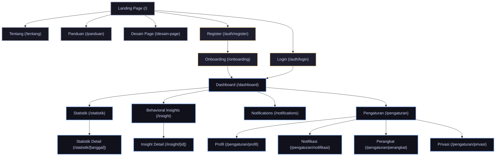

# Sitemap FomoTracker

Dokumen ini berisi pemetaan struktur navigasi, rute (routes), dan pembagian halaman pada platform digital wellbeing **FomoTracker** (Web App).

---

## 1. Arsitektur Navigasi Halaman

Berikut adalah diagram visual hubungan antar halaman dan alur perjalanan pengguna (user journey) di dalam platform FomoTracker.

## 2. Tabel Daftar Rute Halaman (Routes Directory)

| Rute Halaman             | Jenis Akses | Lokasi File Komponen                           | Deskripsi Singkat                                                                     |
| :----------------------- | :---------: | :--------------------------------------------- | :------------------------------------------------------------------------------------ |
| `/`                      |   Publik    | `src/app/page.tsx`                             | Landing page platform, informasi umum, SDGs, dan CTA pendaftaran.                     |
| `/tentang`               |   Publik    | `src/app/tentang/page.tsx`                     | Halaman informasi tentang pengembang, latar belakang proyek, dan visi/misi.           |
| `/panduan`               |   Publik    | `src/app/panduan/page.tsx`                     | Panduan integrasi mobile app, browser extension, dan panduan penggunaan web.          |
| `/desain-page`           |   Publik    | `src/app/desain-page/page.tsx`                 | Dokumentasi komponen visual, tema, dan panduan desain UI FomoTracker.                 |
| `/auth/login`            | Autentikasi | `src/app/auth/login/page.tsx`                  | Form masuk pengguna ke aplikasi.                                                      |
| `/auth/register`         | Autentikasi | `src/app/auth/register/page.tsx`               | Form pendaftaran akun baru.                                                           |
| `/onboarding`            | Autentikasi | `src/app/onboarding/page.tsx`                  | Setup awal pengguna baru dan konfigurasi profil wellbeing.                            |
| `/dashboard`             |  Proteksi   | `src/app/(app)/dashboard/page.tsx`             | Dashboard utama: visualisasi ringkas screen time, behavioral score, dan level risiko. |
| `/statistik`             |  Proteksi   | `src/app/(app)/statistik/page.tsx`             | Analisis tren penggunaan aplikasi per jam, harian, dan grafik sebaran kategori.       |
| `/statistik/[tanggal]`   |  Proteksi   | `src/app/(app)/statistik/[tanggal]/page.tsx`   | Rincian aktivitas dan grafik penggunaan aplikasi pada tanggal tertentu.               |
| `/insight`               |  Proteksi   | `src/app/(app)/insight/page.tsx`               | Daftar rekomendasi dan analisis kebiasaan digital berbasis kecerdasan buatan (AI).    |
| `/insight/[id]`          |  Proteksi   | `src/app/(app)/insight/[id]/page.tsx`          | Rincian analisis perilaku (behavioral analysis report) personal dari modul AI.        |
| `/notifications`         |  Proteksi   | `src/app/(app)/notifications/page.tsx`         | Pusat log notifikasi cerdas yang telah dikirim ke perangkat pengguna.                 |
| `/pengaturan`            |  Proteksi   | `src/app/(app)/pengaturan/page.tsx`            | Panel utama pengaturan konfigurasi akun dan sistem FomoTracker.                       |
| `/pengaturan/profil`     |  Proteksi   | `src/app/(app)/pengaturan/profil/page.tsx`     | Pengaturan informasi data pribadi dan ubah sandi pengguna.                            |
| `/pengaturan/notifikasi` |  Proteksi   | `src/app/(app)/pengaturan/notifikasi/page.tsx` | Pengaturan preferensi, jadwal, dan ambang batas limit (threshold) notifikasi.         |
| `/pengaturan/perangkat`  |  Proteksi   | `src/app/(app)/pengaturan/perangkat/page.tsx`  | Integrasi mobile tracking melalui sinkronisasi Android Usage Stats API.               |
| `/pengaturan/privasi`    |  Proteksi   | `src/app/(app)/pengaturan/privasi/page.tsx`    | Pengaturan persetujuan data, ekspor data, dan penutupan akun.                         |

---

## 3. Rincian Fungsionalitas Halaman

### A. Halaman Publik (Public Area)

- **Landing Page (`/`)**:
  - Mengenalkan platform FomoTracker kepada pengunjung.
  - Menyajikan poin masalah perilaku digital (doomscrolling, compulsive checking, midnight usage).
  - Tautan unduhan client platform: FomoTracker Mobile (Android) & Browser Extension.
  - Informasi kontribusi terhadap target PBB: SDGs 3 (Good Health), SDGs 4 (Quality Education), SDGs 8 (Decent Work & Economic Growth).
- **Tentang Aplikasi (`/tentang`)**:
  - Memperkenalkan tim pengembang platform FomoTracker untuk kompetisi OLIVIA XI 2026.
  - Latar belakang penelitian ilmiah (BSMAS - Bergen Social Media Addiction Scale) dan landasan teori digital wellbeing.
- **Panduan (`/panduan`)**:
  - Langkah detail pemasangan aplikasi tracker pada ponsel Android (menghubungkan API).
  - Petunjuk instalasi ekstensi peramban (browser extension) agar sinkronisasi data real-time berjalan mulus.
- **Desain Panduan (`/desain-page`)**:
  - Menampilkan UI style guide yang digunakan seperti warna, tipografi, kartu metrik, tata letak grafik, tombol, dan komponen interaktif.

### B. Alur Autentikasi (Authentication Flow)

- **Sign In (`/auth/login`) & Sign Up (`/auth/register`)**:
  - Registrasi menggunakan nama, email, password, dan konfirmasi.
  - Masuk menggunakan email dan password yang terhubung ke database PostgreSQL via Supabase.
- **Onboarding (`/onboarding`)**:
  - Membantu pengguna mengatur target batas waktu screen time media sosial harian yang diinginkan.
  - Mengisi kuesioner singkat untuk analisis profil risiko awal.

### C. Dasbor Aplikasi Utama (Protected Workspace - `/app`)

Seluruh halaman ini berada di bawah rute grup `(app)` yang membutuhkan status masuk aktif (authenticated session).

- **Dashboard (`/dashboard`)**:
  - Menampilkan metrik utama: total screen time hari ini, persentase perubahan dari hari kemarin, status habit streak.
  - Indikator **Skor Perilaku (Behavioral Score)** dari rentang 0-100 dan penentuan **Tingkat Risiko (Risk Level)**: Low, Moderate, atau High.
  - Bagian visualisasi _Top Apps Used_ (Aplikasi paling sering diakses).
  - AI Insight ringkas: Rekomendasi dinamis berbasis AI untuk membantu pencegahan kecanduan digital.
- **Statistik (`/statistik`)**:
  - Menyediakan bagan analisis detail (Recharts).
  - Grafik perbandingan durasi pemakaian media sosial vs produktivitas harian.
  - Analisis porsi akses (misal: Instagram 40%, TikTok 30%, dll.).
  - Statistik waktu penggunaan (siang vs malam hari).
  - Detail per tanggal (`/statistik/[tanggal]`) membolehkan pengguna melihat tren masa lalu untuk refleksi mingguan atau bulanan.
- **Behavioral Insights (`/insight`)**:
  - Menyediakan laporan berkala (harian/mingguan) hasil generasi AI (melalui integrasi OpenRouter / LLM API).
  - Menyajikan pola kebiasaan yang berisiko, seperti: _"Terlalu banyak membuka ponsel di jam kerja"_ atau _"Sesi screen time malam hari tinggi"_.
  - Menawarkan modul refleksi diri dan tips praktis.
- **Smart Notifications (`/notifications`)**:
  - Riwayat peringatan otomatis seperti _Focus Alert_, _Continuous Usage Alert_, dan _Sleep Hour Warning_.
- **Pengaturan (`/pengaturan/*`)**:
  - **Profil**: Mengelola kredensial dan preferensi nama tampilan.
  - **Notifikasi**: Mengaktifkan/menonaktifkan jenis alert tertentu dan menyetel ambang batas durasi (misal: ingatkan saya jika scroll media sosial terus menerus selama 45 menit).
  - **Perangkat**: Menyediakan kode otorisasi sinkronisasi perangkat mobile Android (menggunakan Android Usage Stats API).
  - **Privasi**: Manajemen izin pelacakan aktivitas dan kebijakan penghapusan data secara permanen.
